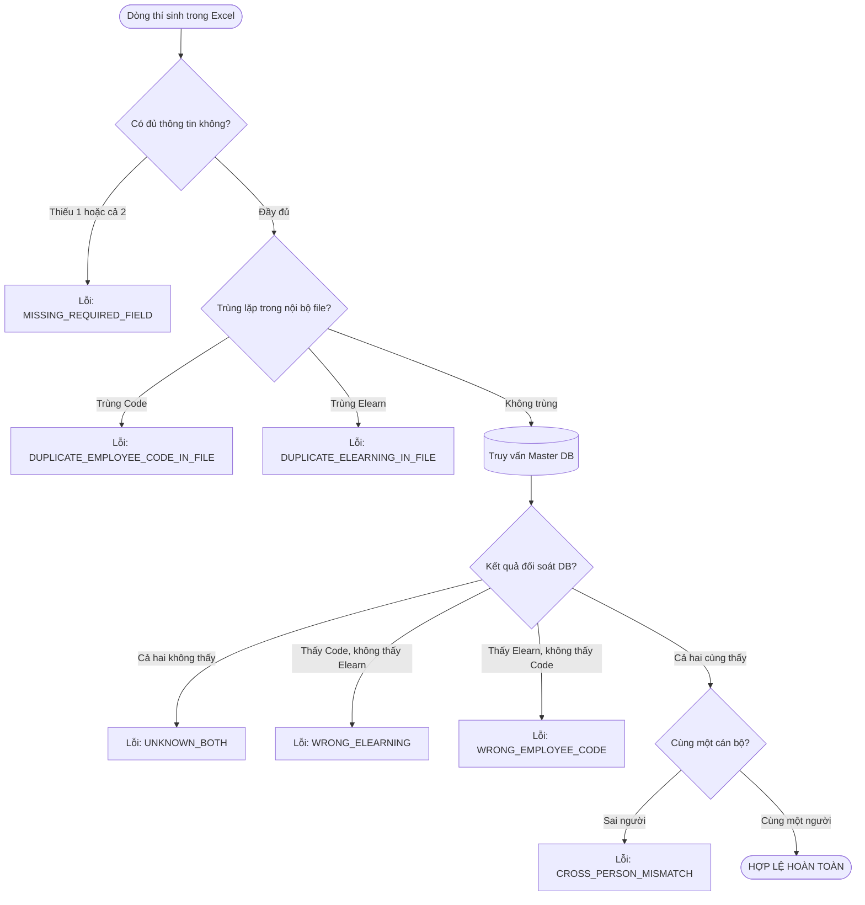
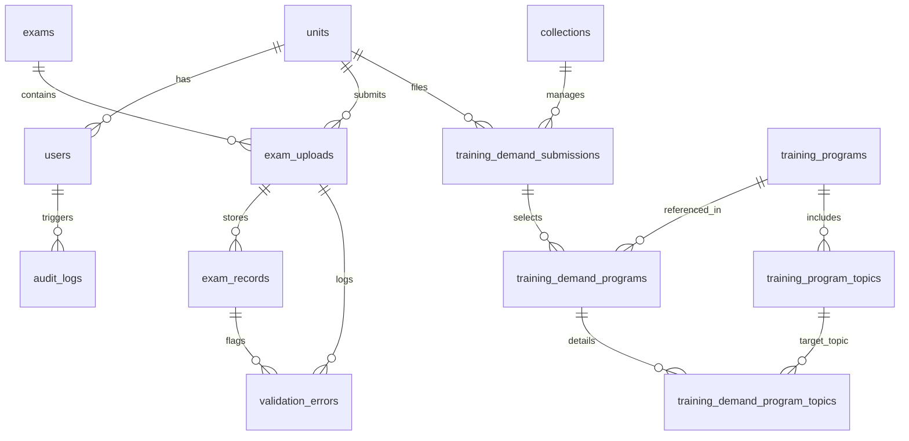
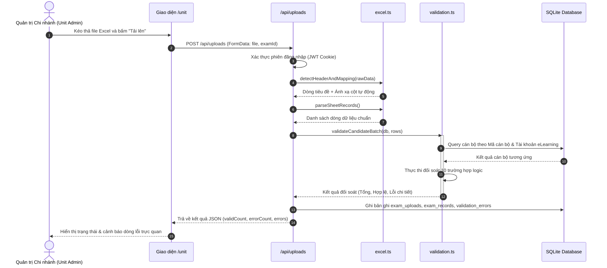
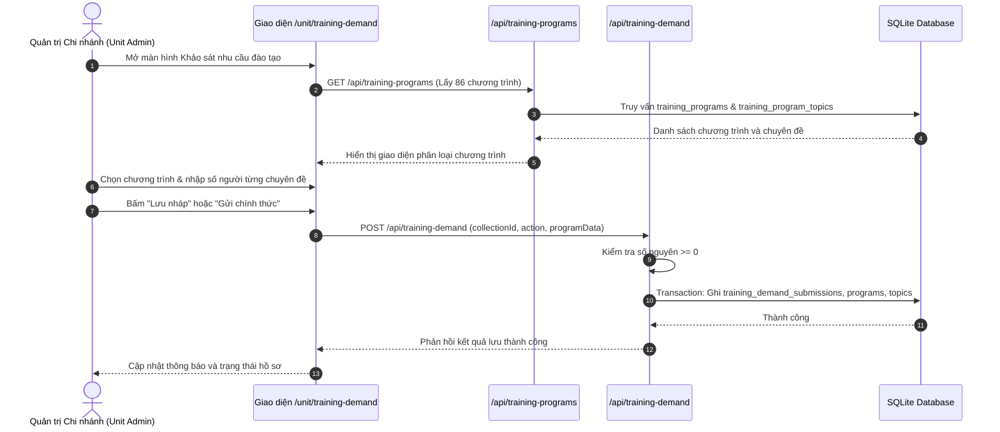
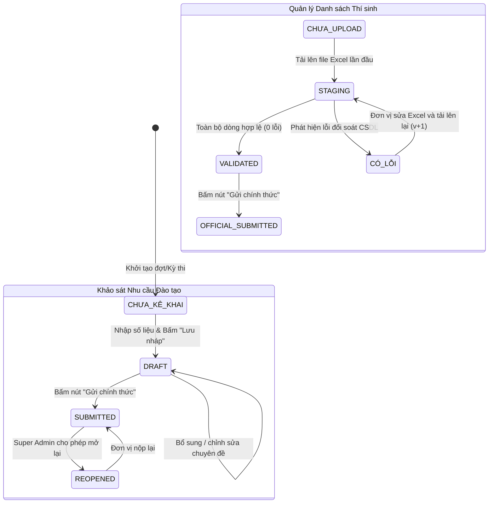

# TÀI LIỆU MÔ TẢ KỸ THUẬT HỆ THỐNG
## ỨNG DỤNG THU THẬP THÔNG TIN VÀ KHẢO SÁT DỮ LIỆU ĐA ĐƠN VỊ (AGRIBANK DATA COLLECTION PLATFORM)

> **Phiên bản tài liệu:** 1.0.0  
> **Ngày lập:** 06/10/2026  
> **Đối tượng áp dụng:** Đội ngũ phát triển (Developers), Quản trị hệ thống (DevOps/SysAdmin), Kiểm toán kỹ thuật (Technical Audit).  
> **Nguyên tắc biên soạn:** Chỉ mô tả thực tế hiện trạng có trong mã nguồn (`Source Code Audit`). Không suy đoán, không giả định. Mọi cấu phần nghiệp vụ đều đính kèm vị trí file và hàm/lớp chịu trách nhiệm.

---

## 1. TỔNG QUAN

### 1.1. Mục đích ứng dụng & Vấn đề giải quyết
* **Mục đích:** Xây dựng nền tảng tập trung trực tuyến phục vụ việc thu thập, kiểm tra chéo (đối chiếu 2 chiều tự động), xác thực dữ liệu và tổng hợp số liệu từ các đơn vị trực thuộc (chi nhánh/đơn vị loại 1, đơn vị sự nghiệp toàn hệ thống Agribank gồm hơn 162 đơn vị).
* **Người dùng mục tiêu:**
  * **Super Admin (Quản trị viên Trung tâm):** Khởi tạo kỳ thi/đợt khảo sát, quản lý cơ sở dữ liệu cán bộ trung tâm (Master DB), quản trị danh mục khung chương trình đào tạo/vị trí chức danh, theo dõi tiến độ kê khai toàn mạng lưới theo thời gian thực (real-time dashboard), xem nhật ký kiểm toán (audit trail) và xuất báo cáo tổng hợp cấp toàn ngành.
  * **Unit Admin (Quản trị viên Đơn vị / Chi nhánh):** Tự đăng nhập tài khoản theo mã đơn vị, tải lên danh sách thí sinh dự thi (file Excel) để hệ thống tự động kiểm tra đối soát 100% dòng dữ liệu với Master DB; tự lựa chọn khung chương trình đào tạo (trong khung và ngoài khung) để đăng ký số lượng nhân sự có nhu cầu theo từng chuyên đề; xác nhận gửi chính thức (`OFFICIAL_SUBMITTED`).
  * **Viewer (Người xem báo cáo):** Xem số liệu thống kê tổng hợp mạng lưới không có quyền ghi/sửa.
* **Vấn đề giải quyết triệt để:**
  * Loại bỏ hoàn toàn quy trình thủ công tiếp nhận và ghép 162 file Excel rời rạc qua email.
  * Chặn đứng sai lệch định danh thí sinh (sai mã cán bộ, sai tài khoản eLearning, nhầm lẫn cán bộ giữa các chi nhánh) nhờ thuật toán đối chiếu 2 chiều thời gian thực trước khi nộp.
  * Tự động hóa quá trình tổng hợp ma trận nhu cầu đào tạo theo chuyên đề, chức danh và đơn vị.

### 1.2. Công nghệ sử dụng
* **Ngôn ngữ:** TypeScript 5.7.2, Node.js (hỗ trợ Node 22+ / 24+).
* **Framework Web:** Next.js 15.1.0 (kiến trúc Fullstack App Router, Server Components kết hợp Client Components và Next.js API Routes).
* **Frontend UI & Styling:** React 19.0.0, TailwindCSS 3.4.17, Bộ icon Lucide React 1.16.0.
* **Cơ sở dữ liệu (Database):** CSDL cục bộ nhúng `node:sqlite` (module SQLite DatabaseSync đồng bộ nguyên bản của Node.js, không phụ thuộc C++ native addon biên dịch ngoài).
  * Chế độ hoạt động: WAL mode (`PRAGMA journal_mode = WAL; PRAGMA synchronous = NORMAL; PRAGMA foreign_keys = ON;`).
  * Tệp lưu trữ: `data/database.sqlite`.
* **Thư viện xử lý dữ liệu:**
  * `xlsx` (^0.18.5): Đọc, phân tích cú pháp (parsing) file Excel tải lên và sinh file Excel xuất báo cáo.
  * `docx` (^9.8.1): Xử lý tài liệu Word.
  * `bcryptjs` (^3.0.3): Băm và kiểm tra mật khẩu người dùng (Salt rounds = 10).
  * `jsonwebtoken` (^9.0.2): Sinh và xác thực JWT token (HS256).

### 1.3. Phương thức vận hành & Môi trường triển khai
* **Mô hình hoạt động:** Ứng dụng Web tập trung (Web-based application) chạy trên môi trường Intranet/LAN nội bộ hoặc Web Server đám mây có IP cố định.
* **Môi trường yêu cầu:**
  * Hệ điều hành: Windows Server / Windows 10/11 hoặc Linux (Ubuntu 22.04+).
  * Runtime: Node.js version 22 trở lên (bắt buộc để hỗ trợ `node:sqlite`).
* **Lệnh khởi chạy:**
  * Môi trường phát triển: `npm run dev` (chạy trên cổng mặc định `http://localhost:3000`).
  * Môi trường sản xuất: `npm run build && npm start`.
  * Khởi tạo CSDL ban đầu: `npm run db:init` (thực thi `schema.sql`).
  * Nạp dữ liệu mẫu/danh mục: `npm run db:seed`.

---

## 2. CẤU TRÚC DỰ ÁN

```text
App web đơn vị tự kê khai/
├── data/
│   └── database.sqlite               # File SQLite CSDL chính (WAL mode)
├── docs/
│   └── MO_TA_UNG_DUNG.md             # Tài liệu mô tả kỹ thuật chi tiết của hệ thống
├── public/                           # Chứa tài nguyên tĩnh (static assets)
├── scripts/                          # Bộ scripts bảo trì, nạp dữ liệu và kiểm thử tự động
│   ├── init_database.js              # Script khởi tạo các bảng và chỉ mục từ schema.sql
│   ├── seed_database.js              # Nạp danh sách đơn vị, tài khoản Admin và cán bộ mẫu
│   ├── seed_multi_forms.js           # Khởi tạo dữ liệu mẫu cho bộ Form động (Collections & Forms)
│   ├── seed_official_programs.ts     # Nạp 60 khung chương trình đào tạo Trong Khung (Phụ lục I-IV)
│   ├── seed_out_of_frame_programs.ts # Nạp 26 khung chương trình đào tạo Ngoài Khung (6 nhóm)
│   ├── import_training_catalog.ts    # Phân tích file Excel phụ lục danh mục đào tạo vào CSDL
│   ├── sync_units_from_table.js      # Đồng bộ hóa danh mục 162/305 đơn vị vào bảng units
│   ├── test_validation_engine.js     # Bộ test 9 kịch bản kiểm tra đối chiếu cán bộ
│   ├── test_training_demand_suite.ts # Bộ test 15 kịch bản tự động cho module Khảo sát đào tạo
│   └── test_stage5_suite.ts          # Bộ test 14 bài chuẩn khắt khe cho Stage 5
├── src/
│   ├── app/                          # Next.js App Router (Frontend Pages & Backend API Routes)
│   │   ├── admin/                    # Giao diện dành riêng cho Super Admin
│   │   │   ├── audit-log/page.tsx    # Màn hình tra cứu nhật ký kiểm toán hệ thống
│   │   │   ├── exams/page.tsx        # Màn hình quản lý các kỳ thi/đợt kiểm tra
│   │   │   ├── forms/page.tsx        # Màn hình cấu hình Form động (Form Builder)
│   │   │   ├── master-db/page.tsx    # Màn hình quản lý 34.000+ cán bộ trung tâm
│   │   │   ├── training-demand/page.tsx # Màn hình tổng hợp ma trận khảo sát đào tạo
│   │   │   └── page.tsx              # Bảng điều khiển trung tâm (Super Admin Dashboard)
│   │   ├── api/                      # Backend REST API Endpoints
│   │   │   ├── audit-logs/route.ts   # API truy vấn nhật ký thao tác
│   │   │   ├── auth/
│   │   │   │   ├── change-password/route.ts # API đổi mật khẩu cá nhân
│   │   │   │   ├── login/route.ts    # API xác thực người dùng & cấp phát JWT Cookie
│   │   │   │   ├── logout/route.ts   # API đăng xuất, xóa Cookie
│   │   │   │   ├── me/route.ts       # API lấy thông tin phiên làm việc hiện tại
│   │   │   │   └── reset-password/route.ts # API đặt lại mật khẩu người dùng
│   │   │   ├── confirm-submission/route.ts # API xác nhận chốt gửi chính thức dữ liệu cán bộ
│   │   │   ├── dashboard/
│   │   │   │   ├── admin/route.ts    # API tổng hợp chỉ số toàn hệ thống và ma trận đơn vị
│   │   │   │   └── unit/route.ts     # API lấy thống kê riêng cho đơn vị đang đăng nhập
│   │   │   ├── exams/route.ts        # API CRUD kỳ thi/đợt kiểm tra
│   │   │   ├── export/route.ts       # API xuất file Excel (lỗi, danh sách đơn vị, tổng hợp 162 đơn vị)
│   │   │   ├── forms/route.ts        # API quản trị và nộp dữ liệu Form động
│   │   │   ├── master-employees/route.ts # API tìm kiếm, phân trang CSDL cán bộ trung tâm
│   │   │   ├── records/route.ts      # API phân trang danh sách thí sinh đã upload của đơn vị
│   │   │   ├── submissions/route.ts  # API xử lý upload dữ liệu Form động đa năng
│   │   │   ├── training-catalog/route.ts  # API quản trị danh mục Vị trí - Chuyên đề Master
│   │   │   ├── training-demand/route.ts   # API Kê khai/Lưu nháp/Gửi khảo sát nhu cầu đào tạo
│   │   │   ├── training-programs/route.ts # API danh mục 86 Khung chương trình đào tạo chuẩn
│   │   │   ├── training-reports/route.ts  # API xuất báo cáo tổng hợp & ma trận Excel đào tạo
│   │   │   ├── units/route.ts        # API lấy danh sách chi nhánh/đơn vị
│   │   │   └── uploads/route.ts      # API tiếp nhận file Excel danh sách thí sinh & chạy validation
│   │   ├── login/page.tsx            # Màn hình đăng nhập hệ thống
│   │   ├── unit/                     # Giao diện dành cho Quản trị viên Chi nhánh
│   │   │   ├── training-demand/page.tsx # Màn hình tự kê khai nhu cầu đào tạo của đơn vị
│   │   │   └── page.tsx              # Màn hình Tổng quan mạng lưới, Upload Excel, Báo lỗi, Lịch sử
│   │   ├── globals.css               # Cấu hình stylesheet Tailwind CSS
│   │   ├── layout.tsx                # Root Layout ứng dụng
│   │   └── page.tsx                  # Điều hướng gốc (chuyển tiếp theo quyền sang /admin hoặc /unit)
│   ├── components/                   # Các UI Components tái sử dụng
│   │   ├── AdminSidebar.tsx          # Thanh điều hướng bên trái cho Super Admin
│   │   └── ChangePasswordModal.tsx   # Modal đổi mật khẩu an toàn
│   └── lib/                          # Thư viện dùng chung (Business Logic & Core Engines)
│       ├── audit.ts                  # Module ghi nhật ký kiểm toán hệ thống (logAudit)
│       ├── auth.ts                   # Module xác thực JWT, hash bcrypt, kiểm tra phiên
│       ├── db.ts                     # Module kết nối cơ sở dữ liệu SQLite Singleton (DatabaseSync)
│       ├── excel.ts                  # Engine đọc Excel, nhận diện cột tự động (detectHeaderAndMapping)
│       ├── validation-engine.ts      # Engine kiểm tra dữ liệu Form động & phân loại chế độ kiểm tra
│       └── validation.ts             # Thuật toán đối chiếu 2 chiều thí sinh (validateCandidateBatch)
├── package.json                      # Cấu hình dự án và danh sách thư viện phụ thuộc
├── schema.sql                        # Định nghĩa cấu trúc 21 bảng CSDL và các chỉ mục tốc độ cao
├── tailwind.config.js                # Cấu hình giao diện Tailwind
└── tsconfig.json                     # Cấu hình trình biên dịch TypeScript
```

---

## 3. DANH SÁCH CHỨC NĂNG

### Bảng tổng hợp chức năng

| STT | Mã chức năng | Tên chức năng | Phân quyền | File xử lý chính | Hàm / Phương thức |
|---|---|---|---|---|---|
| 1 | `AUTH_LOGIN` | Đăng nhập hệ thống | Tất cả | `src/app/api/auth/login/route.ts` | `POST()` |
| 2 | `AUTH_ME` | Kiểm tra phiên làm việc | Đã đăng nhập | `src/app/api/auth/me/route.ts` | `GET()` |
| 3 | `AUTH_LOGOUT` | Đăng xuất người dùng | Đã đăng nhập | `src/app/api/auth/logout/route.ts` | `POST()` |
| 4 | `AUTH_PWD` | Đổi mật khẩu cá nhân | Đã đăng nhập | `src/app/api/auth/change-password/route.ts` | `POST()` |
| 5 | `CAND_UPLOAD` | Tải lên Excel & Đối chiếu 2 chiều | `UNIT_ADMIN` | `src/app/api/uploads/route.ts` | `POST()` |
| 6 | `CAND_SUBMIT` | Chốt nộp chính thức danh sách thí sinh | `UNIT_ADMIN` | `src/app/api/confirm-submission/route.ts` | `POST()` |
| 7 | `CAND_RECORDS` | Xem & Phân trang danh sách thí sinh | `UNIT_ADMIN`, `SUPER_ADMIN` | `src/app/api/records/route.ts` | `GET()` |
| 8 | `DASH_UNIT` | Bảng điều khiển đơn vị | `UNIT_ADMIN` | `src/app/api/dashboard/unit/route.ts` | `GET()` |
| 9 | `DASH_ADMIN` | Bảng điều khiển mạng lưới 162 đơn vị | `SUPER_ADMIN`, `UNIT_ADMIN` | `src/app/api/dashboard/admin/route.ts` | `GET()` |
| 10 | `EXP_EXCEL` | Xuất Excel danh sách/lỗi/tổng hợp | Tất cả | `src/app/api/export/route.ts` | `GET()` |
| 11 | `TRN_CATALOG` | Lấy danh mục khung chương trình | Đã đăng nhập | `src/app/api/training-programs/route.ts` | `GET()` |
| 12 | `TRN_DEMAND_GET` | Tải hồ sơ khảo sát đào tạo đơn vị | Đã đăng nhập | `src/app/api/training-demand/route.ts` | `GET()` |
| 13 | `TRN_DEMAND_SAVE` | Lưu nháp / Gửi chính thức khảo sát | `UNIT_ADMIN` | `src/app/api/training-demand/route.ts` | `POST()` |
| 14 | `TRN_REPORTS` | Báo cáo ma trận đào tạo & Xuất Excel | `SUPER_ADMIN` | `src/app/api/training-reports/route.ts` | `GET()` |
| 15 | `MDB_EMP` | Quản lý Master DB 34.000 cán bộ | `SUPER_ADMIN` | `src/app/api/master-employees/route.ts` | `GET()`, `POST()` |
| 16 | `EXAM_MANAGE` | Quản lý Kỳ thi / Đợt kiểm tra | `SUPER_ADMIN` | `src/app/api/exams/route.ts` | `GET()`, `POST()`, `PUT()` |
| 17 | `FORM_BUILDER` | Quản lý Form động đa năng | `SUPER_ADMIN` | `src/app/api/forms/route.ts` | `GET()`, `POST()`, `PUT()` |
| 18 | `AUDIT_LOG` | Tra cứu nhật ký kiểm toán | `SUPER_ADMIN` | `src/app/api/audit-logs/route.ts` | `GET()` |

---

### Chi tiết từng chức năng

#### Chức năng 1: Đăng nhập & Xác thực (`AUTH_LOGIN`)
* **Mục đích:** Xác thực danh tính người dùng và thiết lập phiên đăng nhập an toàn bằng JWT Cookie.
* **Đầu vào:** `username` (chuỗi), `password` (chuỗi). Hỗ trợ nhập trực tiếp mã đơn vị (ví dụ `1300` hệ thống tự map thành `1300_Admin`).
* **Các bước xử lý:**
  1. Trích xuất thông tin đăng nhập, gọi `authenticateUser(username, password)` trong `src/lib/auth.ts`.
  2. Truy vấn bảng `users` kết hợp bảng `units`. Kiểm tra trạng thái `status = 'ACTIVE'`.
  3. Kiểm tra mã hóa mật khẩu bằng `verifyPassword(password, user.password_hash)`.
  4. Nếu hợp lệ, gọi `signToken(payload)` tạo JWT chứa `id`, `username`, `role`, `unitId`, `unitCode`, `unitName` thời hạn 7 ngày.
  5. Đính kèm cookie `auth_token` vào HTTP Response với cấu hình `httpOnly: true`, `sameSite: 'lax'`.
  6. Ghi nhật ký vào bảng `audit_logs` thông qua `logAudit()`.
* **Đầu ra:** Trả về đối tượng JSON `{ success: true, user, redirectUrl }`.
* **Trường hợp lỗi:** Nhập sai tài khoản/mật khẩu -> HTTP 401 `{ error: 'Tên đăng nhập hoặc mật khẩu không chính xác.' }`.
* **Vị trí trong code:**
  * File: `src/app/api/auth/login/route.ts` (Hàm `POST`).
  * Hàm xác thực: `src/lib/auth.ts` -> `authenticateUser()`, `signToken()`.

#### Chức năng 2: Tải lên danh sách thí sinh & Đối chiếu 2 chiều tự động (`CAND_UPLOAD`)
* **Mục đích:** Tiếp nhận file danh sách thí sinh dự thi của chi nhánh, tự động nhận diện cấu trúc Excel và đối soát từng dòng với CSDL trung tâm 34.000 cán bộ.
* **Đầu vào:** File Excel định dạng `.xlsx`, `.xls` gửi qua `FormData`, kèm theo `examId`.
* **Các bước xử lý:**
  1. Kiểm tra quyền `UNIT_ADMIN` qua `getSessionFromRequest(req)`.
  2. Đọc luồng nhị phân (Buffer) bằng `xlsx.read()`.
  3. Quét tiêu đề và cấu hình map cột tự động qua `detectHeaderAndMapping(sheetData)` trong `src/lib/excel.ts`.
  4. Phân tích từng dòng dữ liệu thành cấu trúc chuẩn thông qua `parseSheetRecords()`.
  5. Kích hoạt Engine đối chiếu 2 chiều `validateCandidateBatch(db, rows)` trong `src/lib/validation.ts`.
  6. Mở Transaction CSDL: Lưu bản ghi vào `exam_uploads` (tự động tăng `version` nếu upload lại), lưu 100% các cột nguyên bản của đơn vị vào trường `raw_data` của bảng `exam_records`, lưu chi tiết lỗi vào `validation_errors`.
  7. Cập nhật số lượng `total_rows`, `valid_rows`, `error_rows`.
* **Đầu ra:** JSON chứa thống kê số dòng hợp lệ, số lỗi, chi tiết lỗi và ID lượt upload.
* **Trường hợp lỗi:** File không đúng định dạng -> HTTP 400; File rỗng -> HTTP 400; Kỳ thi đã đóng -> HTTP 400.
* **Vị trí trong code:**
  * File: `src/app/api/uploads/route.ts` (Hàm `POST`).
  * Xử lý Excel: `src/lib/excel.ts` -> `detectHeaderAndMapping()`, `parseSheetRecords()`.
  * Đối soát: `src/lib/validation.ts` -> `validateCandidateBatch()`.

#### Chức năng 3: Chốt nộp chính thức dữ liệu thi (`CAND_SUBMIT`)
* **Mục đích:** Cho phép chi nhánh gửi chính thức danh sách thí sinh lên Hội đồng sau khi đã sửa hết các lỗi đối chiếu.
* **Đầu vào:** `uploadId` (số nguyên).
* **Các bước xử lý:**
  1. Kiểm tra phiên người dùng và quyền đơn vị (chỉ được nộp bản ghi do đơn vị mình tải lên).
  2. Kiểm tra bản ghi `exam_uploads`: nếu `error_rows > 0` thì từ chối nộp.
  3. Cập nhật `status = 'OFFICIAL_SUBMITTED'`, lưu thời gian `submitted_at = CURRENT_TIMESTAMP`.
  4. Ghi nhật ký `logAudit` với hành động `SUBMIT_EXAM_RECORDS`.
* **Đầu ra:** JSON `{ success: true, message: 'Đã gửi danh sách chính thức thành công!' }`.
* **Trường hợp lỗi:** Bản ghi vẫn còn lỗi chưa sửa -> HTTP 400 `{ error: 'Danh sách vẫn còn X lỗi chưa khắc phục.' }`.
* **Vị trí trong code:**
  * File: `src/app/api/confirm-submission/route.ts` (Hàm `POST`).

#### Chức năng 4: Tự kê khai nhu cầu đào tạo theo Khung chương trình (`TRN_DEMAND_SAVE`)
* **Mục đích:** Đơn vị chủ động lựa chọn các khung chương trình đào tạo (trong khung và ngoài khung), nhập số lượng người có nhu cầu theo từng chuyên đề thành phần, lưu nháp hoặc nộp chính thức.
* **Đầu vào:** JSON body gồm: `collectionId`, `action` (`'DRAFT'` hoặc `'SUBMIT'`), `programData` (mảng gồm `{ programId, topics: [{ programTopicId, participantCount }] }`).
* **Các bước xử lý:**
  1. Kiểm tra quyền `UNIT_ADMIN` qua token.
  2. Kiểm tra tính hợp lệ của số người: bắt buộc phải là số nguyên không âm ($\ge 0$). Nếu có số âm hoặc số thập phân -> Từ chối ngay lập tức.
  3. Kiểm tra hoặc tạo bản ghi cha trong `training_demand_submissions`.
  4. Sử dụng Transaction CSDL:
     * Đồng bộ bảng `training_demand_programs`: lưu liên kết chương trình đã chọn.
     * Đồng bộ bảng `training_demand_program_topics`: ghi nhận số người theo từng chuyên đề cụ thể.
  5. Cập nhật trạng thái submission: nếu action là `'SUBMIT'` -> chuyển `status = 'SUBMITTED'`, gán `submitted_at`. Nếu action là `'DRAFT'` -> giữ `status = 'DRAFT'`.
  6. Ghi nhật ký kiểm toán qua `logAudit()`.
* **Đầu ra:** JSON `{ success: true, submissionId, status, message }`.
* **Trường hợp lỗi:** Nhập số người âm/thập phân -> HTTP 400; Đợt khảo sát đã kết thúc -> HTTP 400.
* **Vị trí trong code:**
  * File: `src/app/api/training-demand/route.ts` (Hàm `POST`).

#### Chức năng 5: Bảng điều khiển mạng lưới 162 đơn vị (`DASH_ADMIN`)
* **Mục đích:** Cung cấp bức tranh toàn cảnh theo thời gian thực về tiến độ nộp danh sách thí sinh và tiến độ kê khai nhu cầu đào tạo của toàn bộ các chi nhánh trong hệ thống.
* **Đầu vào:** URL query parameters: `collectionId`, `examId`, `formFilter` (`'ALL'`, `'CANDIDATE_LIST'`, `'TRAINING_DEMAND'`).
* **Các bước xử lý:**
  1. Xác thực quyền truy cập (`SUPER_ADMIN`, `UNIT_ADMIN`, `VIEWER`).
  2. Lấy danh sách toàn bộ các đơn vị từ bảng `units` (sắp xếp theo mã đơn vị).
  3. Truy vấn các bản ghi mới nhất của từng đơn vị từ bảng `exam_uploads` và `training_demand_submissions`.
  4. Tính toán các chỉ số thống kê: tổng số đơn vị đã nộp, chưa nộp, số đơn vị đang có lỗi, tổng số lượt thí sinh, tổng nhu cầu đào tạo.
  5. Gán nhãn trạng thái tổng hợp cho từng đơn vị (`ĐÃ_NỘP`, `CÓ_LỖI`, `ĐANG_SOẠN`, `CHƯA_NỘP`).
* **Đầu ra:** JSON gồm `summary` (chỉ số thẻ thống kê), `unitList` (danh sách chi tiết 162 đơn vị), `exams`, `collections`.
* **Vị trí trong code:**
  * File: `src/app/api/dashboard/admin/route.ts` (Hàm `GET`).

#### Chức năng 6: Báo cáo ma trận đào tạo & Xuất dữ liệu Excel (`TRN_REPORTS` & `EXP_EXCEL`)
* **Mục đích:** Tổng hợp nhu cầu đào tạo toàn hệ thống theo chiều dọc (Chương trình / Chuyên đề) và chiều ngang (162 Đơn vị) và xuất file Excel chuẩn.
* **Đầu vào:** Query params: `type` (`'SUMMARY'`, `'BY_PROGRAM'`, `'BY_POSITION'`, `'BY_TOPIC'`, `'BY_UNIT'`, `'EXPORT_EXCEL'`), `exportFormat`.
* **Các bước xử lý:**
  1. Kiểm tra phiên làm việc.
  2. Nạp dữ liệu đăng ký từ `training_demand_program_topics` kết hợp các bảng danh mục.
  3. Ghép nối tạo ma trận dữ liệu (Pivot data) với các cột là các đơn vị hoặc các chuyên đề.
  4. Sử dụng thư viện `xlsx` tạo workbook, định dạng tiêu đề cột và ghi nhị phân `xlsx.write()`.
  5. Trả về HTTP Response dạng `application/vnd.openxmlformats-officedocument.spreadsheetml.sheet`.
* **Đầu ra:** File Excel tải về máy tính người dùng kèm tiêu đề file chuẩn hóa.
* **Vị trí trong code:**
  * File: `src/app/api/training-reports/route.ts` (Hàm `GET`).
  * File: `src/app/api/export/route.ts` (Hàm `GET`).

---

## 4. NGUỒN DỮ LIỆU VÀ CÁCH THU THẬP

### 4.1. Nguồn dữ liệu & Phương thức tiếp nhận
1. **Dữ liệu thí sinh kiểm tra nghiệp vụ:**
   * **Nguồn:** Các chi nhánh (Unit Admin) tải file Excel mẫu hoặc file nghiệp vụ nội bộ lên hệ thống thông qua giao diện Web (`drag-and-drop` hoặc chọn file).
   * **Phương thức:** Gửi qua HTTP POST multipart/form-data đến endpoint `/api/uploads`.
2. **Dữ liệu khảo sát nhu cầu đào tạo:**
   * **Nguồn:** Người dùng tại chi nhánh tương tác trực tiếp với giao diện Web Form thông qua danh mục 86 Khung chương trình đã phân loại.
   * **Phương thức:** Gửi qua HTTP POST payload JSON đến endpoint `/api/training-demand`.
3. **Dữ liệu cán bộ chuẩn (Master Database):**
   * **Nguồn:** File Excel danh sách nhân sự toàn ngành (hơn 34.000 cán bộ) do Super Admin nạp vào hệ thống.
   * **Phương thức:** Nạp qua giao diện quản trị `/admin/master-db` hoặc qua CLI script `scripts/import_master_cli.js`.

### 4.2. Tần suất & Cơ chế kích hoạt
* **Kích hoạt theo sự kiện (Event-driven):** Quá trình đối soát và xác thực chạy ngay lập tức khi người dùng bấm nút nộp/tải file hoặc lưu khảo sát.
* **Không sử dụng Cronjob định kỳ ngầm:** Dữ liệu được tính toán và lưu trực tiếp vào CSDL SQLite ở trạng thái nhất quán.

### 4.3. Xử lý các tình huống ngoại lệ dữ liệu
* **File Excel thay đổi vị trí dòng tiêu đề:**
  * Hàm `detectHeaderAndMapping()` tự động quét tối đa 30 dòng đầu tiên của sheet Excel, tính điểm khớp từ khóa (keyword matching) để tìm ra dòng tiêu đề thực tế ngay cả khi file có nhiều dòng tiêu đề phụ/quốc hiệu bên trên.
* **File Excel có cấu trúc cột khác nhau:**
  * Hệ thống tự nhận diện các biến thể tên cột: `"mã cán bộ"`, `"mã cb"`, `"mã nv"`, `"tài khoản elearning"`, `"tên đăng nhập"`.
  * Cơ chế bảo toàn dữ liệu: Lưu nguyên bản 100% tất cả các cột của đơn vị vào trường `raw_data` (JSON). Không làm mất bất kỳ thông tin nào của chi nhánh.
* **Dòng dữ liệu rỗng hoặc dòng chữ ký:**
  * Hàm `parseSheetRecords()` tự động lọc bỏ các dòng rỗng hoàn toàn hoặc các dòng ghi chú, ngày tháng ký duyệt ở cuối file.
* **Tải dữ liệu đồng thời từ nhiều đơn vị:**
  * Bật chế độ SQLite WAL (`PRAGMA journal_mode = WAL;`) đảm bảo các tiến trình đọc và ghi không khóa lẫn nhau, hỗ trợ 162 đơn vị thao tác mượt mà không xảy ra nghẽn CSDL.

---

## 5. LOGIC NGHIỆP VỤ VÀ QUY TẮC XỬ LÝ DỮ LIỆU

### 5.1. Thuật toán Đối chiếu 2 chiều thí sinh (`validateCandidateBatch`)
* **Vị trí:** `src/lib/validation.ts` -> `validateCandidateBatch()`.
* **Cơ chế:** Mỗi dòng thí sinh gồm `Mã cán bộ` ($Code$) và `Tài khoản eLearning` ($Elearn$). Hệ thống thực hiện truy vấn độc lập hai chiều vào bảng `employees` để so khớp:



#### Bảng chi tiết 10 Quy tắc ("Nếu ... Thì ...") kiểm tra thí sinh:
1. **Nếu** thiếu cả Mã cán bộ và tài khoản eLearning **thì** gán lỗi `MISSING_REQUIRED_FIELD` ("Thiếu cả Mã cán bộ và Tài khoản eLearning trên dòng kê khai").
2. **Nếu** chỉ thiếu Mã cán bộ **thì** gán lỗi `MISSING_REQUIRED_FIELD` ("Thiếu Mã cán bộ trên dòng kê khai").
3. **Nếu** chỉ thiếu tài khoản eLearning **thì** gán lỗi `MISSING_REQUIRED_FIELD` ("Thiếu Tài khoản eLearning trên dòng kê khai").
4. **Nếu** Mã cán bộ xuất hiện từ 2 dòng trở lên trong file Excel **thì** gán lỗi `DUPLICATE_EMPLOYEE_CODE_IN_FILE` kèm chỉ số các dòng bị trùng.
5. **Nếu** Tài khoản eLearning xuất hiện từ 2 dòng trở lên trong file Excel **thì** gán lỗi `DUPLICATE_ELEARNING_IN_FILE` kèm chỉ số các dòng bị trùng.
6. **Nếu** Mã cán bộ có trong CSDL nhưng tài khoản eLearning không khớp **thì** gán lỗi `WRONG_ELEARNING` (Thông báo rõ tài khoản đúng trong CSDL).
7. **Nếu** Tài khoản eLearning có trong CSDL nhưng Mã cán bộ không khớp **thì** gán lỗi `WRONG_EMPLOYEE_CODE` (Thông báo rõ mã cán bộ và họ tên đúng trong CSDL).
8. **Nếu** Cả Mã cán bộ và Tài khoản eLearning đều tồn tại trong CSDL nhưng thuộc về 2 cán bộ khác nhau **thì** gán lỗi `CROSS_PERSON_MISMATCH` (Lỗi tráo thông tin cán bộ).
9. **Nếu** Cả Mã cán bộ và Tài khoản eLearning đều không tìm thấy trong CSDL **thì** gán lỗi `UNKNOWN_BOTH` ("Không tìm thấy cả Mã cán bộ và tài khoản eLearning trong Database").
10. **Nếu** Cả hai trường đều tồn tại và trỏ chính xác về cùng một bản ghi cán bộ trong CSDL **thì** bản ghi đạt trạng thái `VALID` (Hợp lệ).

---

### 5.2. Quy tắc nghiệp vụ Khảo sát nhu cầu đào tạo
* **Vị trí:** `src/app/api/training-demand/route.ts` (Hàm `POST`).
* **Quy tắc kiểm tra số người:**
  * **Nếu** số lượng người đăng ký $< 0$ **thì** từ chối lưu và trả về lỗi: `"Số người đăng ký không được là số âm."`.
  * **Nếu** số lượng người là số thập phân (không phải số nguyên) **thì** từ chối lưu: `"Số người đăng ký phải là số nguyên."`.
* **Cơ chế Snapshot bất biến:**
  * Khi đơn vị lưu số lượng đăng ký cho một chuyên đề, hệ thống lưu kèm snapshot các thông tin mô tả tại thời điểm kê khai (tên chuyên đề, thời lượng, hình thức) nhằm đảm bảo nếu danh mục Master có chỉnh sửa sau này thì dữ liệu lịch sử khảo sát của đơn vị không bị biến dạng.
* **Cô lập dữ liệu giữa các đợt:**
  * Mỗi đợt thu thập có một `collection_id` độc lập. Dữ liệu kê khai của đợt cũ được bảo toàn nguyên vẹn, không bị ghi đè khi mở đợt mới.

---

## 6. MÔ HÌNH DỮ LIỆU

### 6.1. Chi tiết các bảng CSDL chính (`schema.sql`)

1. **`units`** (Bảng Đơn vị): Quản lý 162/305 chi nhánh và đơn vị toàn hệ thống.
   * `id` (INTEGER, PK), `unit_code` (VARCHAR, UNIQUE), `unit_name` (VARCHAR), `status` (VARCHAR).
2. **`users`** (Bảng Tài khoản):
   * `id` (INTEGER, PK), `username` (VARCHAR, UNIQUE), `password_hash` (VARCHAR), `full_name` (VARCHAR), `role` (VARCHAR: `'SUPER_ADMIN'|'UNIT_ADMIN'|'VIEWER'`), `unit_id` (INTEGER, FK -> `units.id`), `status` (VARCHAR).
3. **`employees`** (Bảng Master DB Cán bộ trung tâm):
   * `id` (INTEGER, PK), `employee_code` (VARCHAR, UNIQUE), `elearning_account` (VARCHAR, UNIQUE), `full_name` (VARCHAR), `unit_code` (VARCHAR), `unit_name` (VARCHAR), `department` (VARCHAR), `position` (VARCHAR).
4. **`exams`** (Bảng Kỳ thi / Đợt kiểm tra):
   * `id` (INTEGER, PK), `code` (VARCHAR, UNIQUE), `title` (VARCHAR), `status` (VARCHAR: `'OPEN'|'CLOSED'`).
5. **`exam_uploads`** (Bảng Lịch sử tải file của đơn vị):
   * `id` (INTEGER, PK), `exam_id` (INTEGER, FK), `unit_id` (INTEGER, FK), `version` (INTEGER), `file_name` (VARCHAR), `total_rows` (INTEGER), `valid_rows` (INTEGER), `error_rows` (INTEGER), `status` (VARCHAR: `'STAGING'|'VALIDATED'|'OFFICIAL_SUBMITTED'`).
6. **`exam_records`** (Bảng Chi tiết thí sinh):
   * `id` (INTEGER, PK), `upload_id` (INTEGER, FK), `employee_code` (VARCHAR), `elearning_account` (VARCHAR), `full_name` (VARCHAR), `raw_data` (TEXT JSON bảo toàn 100% cột), `validation_status` (VARCHAR: `'PENDING'|'VALID'|'INVALID'`).
7. **`validation_errors`** (Bảng Chi tiết lỗi đối chiếu):
   * `id` (INTEGER, PK), `upload_id` (INTEGER, FK), `record_id` (INTEGER, FK), `row_index` (INTEGER), `error_type` (VARCHAR), `error_message` (TEXT).
8. **`training_programs`** (Bảng 86 Khung chương trình đào tạo chuẩn):
   * `id` (INTEGER, PK), `code` (VARCHAR, UNIQUE), `name` (VARCHAR), `group_name` (VARCHAR), `category_type` (VARCHAR: `'TRONG_KHUNG'|'NGOAI_KHUNG'`).
9. **`training_program_topics`** (Bảng Chuyên đề đào tạo theo chương trình):
   * `id` (INTEGER, PK), `program_id` (INTEGER, FK), `topic_name` (VARCHAR), `delivery_method` (VARCHAR), `duration` (VARCHAR), `display_order` (INTEGER).
10. **`training_demand_submissions`** (Bảng Hồ sơ khảo sát đào tạo của đơn vị):
    * `id` (INTEGER, PK), `collection_id` (INTEGER, FK), `unit_id` (INTEGER, FK), `version` (INTEGER), `status` (VARCHAR: `'DRAFT'|'SUBMITTED'|'REOPENED'`).
11. **`training_demand_programs`** (Bảng Chương trình đơn vị lựa chọn):
    * `id` (INTEGER, PK), `submission_id` (INTEGER, FK), `program_id` (INTEGER, FK).
12. **`training_demand_program_topics`** (Bảng Số lượng người đăng ký theo chuyên đề):
    * `id` (INTEGER, PK), `demand_program_id` (INTEGER, FK), `program_topic_id` (INTEGER, FK), `participant_count` (INTEGER $\ge 0$).
13. **`audit_logs`** (Bảng Nhật ký kiểm toán):
    * `id` (INTEGER, PK), `user_id` (INTEGER), `username` (VARCHAR), `unit_id` (INTEGER), `action` (VARCHAR), `details` (TEXT), `ip_address` (VARCHAR), `created_at` (TIMESTAMP).

---

### 6.2. Sơ đồ Quan hệ Thực thể (Mermaid ER Diagram)



---

## 7. SƠ ĐỒ KỸ THUẬT

### 7.1. Sơ đồ Kiến trúc Tổng thể Hệ thống

```mermaid
flowchart TB
    subgraph ClientLayer [Tầng Giao Diện Người Dùng (Client / Web Browser)]
        UA[Quản trị Chi nhánh / Unit Admin]
        SA[Quản trị Trung tâm / Super Admin]
    end

    subgraph NextServer [Tầng Ứng Dụng (Next.js 15 Fullstack Server)]
        subgraph AppRouter [Next.js App Router]
            PageLogin["/login (Đăng nhập)"]
            PageUnit["/unit (Dashboard Đơn vị)"]
            PageDemand["/unit/training-demand (Khảo sát Đào tạo)"]
            PageAdmin["/admin (Tổng quan Mạng lưới 162 Đơn vị)"]
            PageMasterDB["/admin/master-db (Quản trị Cán bộ)"]
        end

        subgraph CoreLibraries [Core Engines & Utilities]
            AuthEngine["auth.ts (JWT / Bcrypt / Session)"]
            ExcelEngine["excel.ts (Auto Header & Column Mapping)"]
            ValidationEngine["validation.ts (Bidirectional Engine)"]
            AuditEngine["audit.ts (Action Logger)"]
        end

        subgraph APIEndPoints [API Routes Endpoints]
            API_Auth["/api/auth/*"]
            API_Upload["/api/uploads"]
            API_Demand["/api/training-demand"]
            API_Dashboard["/api/dashboard/*"]
            API_Export["/api/export & /api/training-reports"]
        end
    end

    subgraph StorageLayer [Tầng Cơ Sở Dữ Liệu]
        SQLiteDB[("SQLite WAL Database (data/database.sqlite)")]
    end

    UA --> PageLogin & PageUnit & PageDemand
    SA --> PageLogin & PageAdmin & PageMasterDB
    
    PageUnit --> API_Upload & API_Dashboard & API_Export
    PageDemand --> API_Demand
    PageAdmin --> API_Dashboard & API_Export

    API_Auth --> AuthEngine --> SQLiteDB
    API_Upload --> ExcelEngine & ValidationEngine --> SQLiteDB
    API_Demand --> SQLiteDB
    API_Dashboard --> SQLiteDB
    API_Export --> SQLiteDB
    API_Upload -.-> AuditEngine --> SQLiteDB
```

---

### 7.2. Sơ đồ Trình tự Tải lên và Kiểm tra Danh sách Thí sinh (Sequence Diagram)



---

### 7.3. Sơ đồ Trình tự Kê khai Nhu cầu Đào tạo (Sequence Diagram)



---

### 7.4. Sơ đồ Vòng đời Trạng thái Dữ liệu (State Machine Diagram)



---

## 8. PHÂN QUYỀN VÀ BẢO MẬT

### 8.1. Ma trận Phân quyền (Role-Based Access Control - RBAC)

| Chức năng / Tài nguyên | `SUPER_ADMIN` | `UNIT_ADMIN` | `VIEWER` | Chưa đăng nhập |
|---|:---:|:---:|:---:|:---:|
| Đăng nhập, đổi mật khẩu | Cho phép | Cho phép | Cho phép | Đăng nhập |
| Xem Tổng quan mạng lưới 162 đơn vị | Cho phép | Cho phép | Cho phép | Từ chối |
| Tải file Excel danh sách thí sinh | Từ chối | Chỉ đơn vị mình | Từ chối | Từ chối |
| Chốt nộp danh sách thí sinh | Từ chối | Chỉ đơn vị mình | Từ chối | Từ chối |
| Xem danh sách thí sinh của đơn vị khác | Cho phép | Từ chối | Từ chối | Từ chối |
| Kê khai / Chỉnh sửa khảo sát đào tạo | Từ chối | Chỉ đơn vị mình | Từ chối | Từ chối |
| Quản trị Kỳ thi / Biểu mẫu động | Cho phép | Từ chối | Từ chối | Từ chối |
| Quản trị Master DB (34.000 cán bộ) | Cho phép | Từ chối | Từ chối | Từ chối |
| Xem Nhật ký kiểm toán (Audit Log) | Cho phép | Từ chối | Từ chối | Từ chối |
| Xuất báo cáo tổng hợp toàn ngành | Cho phép | Từ chối | Cho phép | Từ chối |

### 8.2. Cơ chế Xác thực & Phiên làm việc (Session)
* **JWT (JSON Web Token):**
  * Token ký bằng thuật toán HS256 (`jsonwebtoken`), hạn dùng 7 ngày (`expiresIn: '7d'`).
  * Trích xuất linh hoạt: Hỗ trợ cả Header `Authorization: Bearer <token>` và Cookie trình duyệt `auth_token` (`src/lib/auth.ts` -> `getSessionFromRequest()`).
* **Băm mật khẩu (Password Hashing):**
  * Sử dụng thư viện `bcryptjs` với 10 vòng sinh muối (`saltRounds = 10`), bảo vệ mật khẩu chống tấn công rainbow table.
* **Bảo vệ ranh giới dữ liệu giữa các đơn vị (Data Isolation):**
  * Tại mọi API nghiệp vụ (`/api/uploads`, `/api/records`, `/api/training-demand`), mã nguồn đều cưỡng chế kiểm tra `session.unitId`. Nếu `UNIT_ADMIN` cố tình truyền `unitId` của đơn vị khác trong URL query params, hệ thống sẽ tự động gán lại về `session.unitId` hoặc trả về HTTP 403 Forbidden.

---

## 9. XỬ LÝ LỖI, GHI LOG VÀ HIỆU NĂNG

### 9.1. Quản lý Lỗi & Mã phản hồi HTTP (HTTP Status Codes)
* `200 OK`: Yêu cầu thực thi thành công.
* `400 Bad Request`: Dữ liệu đầu vào sai định dạng, thiếu trường bắt buộc, hoặc số người âm/thập phân.
* `401 Unauthorized`: Chưa đăng nhập hoặc JWT Token hết hạn.
* `403 Forbidden`: Người dùng không có quyền truy cập tài nguyên của đơn vị khác hoặc tài nguyên quản trị.
* `404 Not Found`: Không tìm thấy bản ghi kỳ thi, biểu mẫu hoặc chương trình đào tạo.
* `500 Internal Server Error`: Lỗi phát sinh trong tầng xử lý CSDL hoặc ngoại lệ hệ thống; lỗi được bắt trong khối `try...catch` và in ra log máy chủ.

### 9.2. Ghi nhật ký kiểm toán (Audit Logging)
* Module tập trung: `src/lib/audit.ts` -> `logAudit(entry)`.
* Tự động lưu mọi hành vi nhạy cảm: `LOGIN`, `CHANGE_PASSWORD`, `UPLOAD_EXAM_FILE`, `SUBMIT_EXAM_RECORDS`, `SAVE_TRAINING_DEMAND_DRAFT`, `SUBMIT_TRAINING_DEMAND`, `EXPORT_ERRORS`, `EXPORT_ALL_RECORDS`.
* Dữ liệu log bao gồm: `user_id`, `username`, `unit_id`, `action`, `details` (dưới dạng chuỗi JSON), `ip_address`, `created_at`.

### 9.3. Tối ưu Hiệu năng (Performance Optimization)
* **SQLite WAL & Normal Sync:** Tối ưu hóa I/O đĩa, cho phép đọc ghi đồng thời tốc độ cao mà không gây lock database.
* **Hệ thống Chỉ mục (Indexes) tốc độ cao:**
  * Bảng `employees`: đánh chỉ mục trên `employee_code`, `elearning_account`, `unit_code`.
  * Bảng `exam_records`: đánh chỉ mục trên `upload_id`, `employee_code`, `elearning_account`.
  * Bảng `training_demand_topics`: đánh chỉ mục trên `demand_position_id`, `topic_id`.
* **Phân trang dữ liệu tại Server (Server-side Pagination):**
  * API `/api/records` và `/api/master-employees` sử dụng mệnh đề `LIMIT ... OFFSET ...` đảm bảo dù bảng có hàng chục nghìn dòng, thời gian phản hồi giao diện luôn dưới 100ms.

---

## 10. KIỂM THỬ (TESTING)

Hệ thống được trang bị bộ kiểm thử tự động toàn diện thông qua các script kiểm tra độc lập tại thư mục `scripts/`:

### 10.1. Bộ test đối chiếu cán bộ (`scripts/test_validation_engine.js`)
* **Lệnh chạy:** `npm run test:validation`
* **Kết quả thực tế:** **9/9 bài kiểm thử ĐẠT (100% PASS)**.
* **Nội dung kiểm tra:**
  1. Case 1: Đúng cả Mã CB và eLearning -> Hợp lệ hoàn toàn.
  2. Case 2: Đúng Mã CB nhưng sai eLearning -> Báo lỗi `WRONG_ELEARNING`.
  3. Case 3: Đúng eLearning nhưng sai Mã CB -> Báo lỗi `WRONG_EMPLOYEE_CODE`.
  4. Case 4: Cả hai tồn tại nhưng tráo của hai người khác nhau -> Báo lỗi `CROSS_PERSON_MISMATCH`.
  5. Case 7: Cả hai không tồn tại trong DB -> Báo lỗi `UNKNOWN_BOTH`.
  6. Case 8: Trùng lặp Mã CB trong chính nội bộ file Excel -> Báo lỗi `DUPLICATE_EMPLOYEE_CODE_IN_FILE`.
  7. Case 9: Trùng lặp eLearning trong chính nội bộ file Excel -> Báo lỗi `DUPLICATE_ELEARNING_IN_FILE`.
  8. Case 10: Thiếu trường bắt buộc -> Báo lỗi `MISSING_REQUIRED_FIELD`.
  9. Bảo toàn dữ liệu: Đảm bảo không ghi đè cột nghiệp vụ của đơn vị.

### 10.2. Bộ test khảo sát nhu cầu đào tạo (`scripts/test_training_demand_suite.ts`)
* **Lệnh chạy:** `npx tsx scripts/test_training_demand_suite.ts`
* **Kết quả thực tế:** **15/15 bài kiểm thử ĐẠT (100% PASS)**.
* **Nội dung kiểm tra:** Lọc chuyên đề theo vị trí/chương trình, lưu số người hợp lệ, từ chối số âm, từ chối số thập phân, cảnh báo vượt biên, tính năng áp dụng cho tất cả, tính toán tổng hợp toàn mạng lưới khớp 100% với chi tiết, bảo vệ phân quyền chống truy cập chéo.

### 10.3. Bộ test khắt khe Stage 5 (`scripts/test_stage5_suite.ts`)
* **Lệnh chạy:** `npx tsx scripts/test_stage5_suite.ts`
* **Kết quả thực tế:** **14/14 bài kiểm thử ĐẠT (100% PASS)**.
* **Nội dung kiểm tra:** Ràng buộc `UNIQUE(submission_id, position_id)`, tính độc lập dữ liệu giữa 2 đơn vị khác nhau, tính độc lập giữa 2 kỳ khảo sát khác nhau, bảo toàn dữ liệu lịch sử khi Master Catalog chuyển trạng thái `INACTIVE`.

---

## 11. ĐIỂM CHƯA CHẮC CHẮN, TỒN TẠI VÀ RỦI RO KỸ THUẬT

Theo nguyên tắc minh bạch tuyệt đối của đợt kiểm toán mã nguồn, dưới đây là các điểm tồn tại, giá trị hardcode, code chưa tối ưu và rủi ro kỹ thuật được phát hiện trực tiếp trong source code hiện tại:

### 1. Cơ chế Mật khẩu dự phòng cố định (Hardcoded Password Fallback)
* **Vị trí phát hiện:**
  * File `src/lib/auth.ts`, dòng 83-85:
    ```typescript
    if (!valid && user.role === 'UNIT_ADMIN' && (password === 'Unit@123456' || password === '123456')) {
      valid = true;
    }
    ```
  * File `src/app/api/auth/change-password/route.ts`, dòng 34-36.
* **Mô tả thực tế:** Mã nguồn đang cài đặt mật khẩu dự phòng hardcode `Unit@123456` hoặc `123456` cho mọi tài khoản có vai trò `UNIT_ADMIN`. Nếu mật khẩu trong CSDL không khớp, hệ thống vẫn cho phép đăng nhập thành công bằng mật khẩu dự phòng này.
* **Rủi ro kỹ thuật:** Rủi ro an ninh thông tin nghiêm trọng nếu triển khai ra Internet công cộng. Mọi người biết mật khẩu này đều có thể đăng nhập vào tài khoản của bất kỳ chi nhánh nào.
* **Khuyến nghị:** Cần gỡ bỏ đoạn code này hoặc chuyển sang cơ chế quản trị mật khẩu tập trung trước khi Golive chính thức.

### 2. Chuỗi khóa bí mật JWT mặc định (Default JWT Secret Fallback)
* **Vị trí phát hiện:** File `src/lib/auth.ts`, dòng 6:
  ```typescript
  const JWT_SECRET = process.env.JWT_SECRET || 'agribank_candidate_verification_secret_key_2026_super_secure';
  ```
* **Mô tả thực tế:** Nếu tệp `.env` không định nghĩa biến `JWT_SECRET`, hệ thống sẽ sử dụng chuỗi bí mật hardcode cố định trong code.
* **Khuyến nghị:** Bắt buộc nạp biến môi trường từ hệ thống máy chủ và đưa ra cảnh báo lỗi nghiêm trọng chặn khởi động nếu thiếu `JWT_SECRET`.

### 3. Tồn tại song song hai mô hình khảo sát đào tạo trong CSDL
* **Vị trí phát hiện:** File `schema.sql` và các bảng trong `data/database.sqlite`.
* **Mô tả thực tế:**
  * Mô hình 1 (Theo Vị trí / Chức danh): Sử dụng các bảng `training_positions`, `training_topics`, `training_position_topics`, `training_demand_positions`, `training_demand_topics` (284 vị trí, 304 chuyên đề).
  * Mô hình 2 (Theo Khung chương trình đào tạo): Sử dụng các bảng `training_programs`, `training_program_topics`, `training_demand_programs`, `training_demand_program_topics` (86 chương trình, 844 chuyên đề).
  * Hiện tại giao diện người dùng đơn vị (`src/app/unit/training-demand/page.tsx`) đã chuyển đổi sang mô hình 86 Khung chương trình. Tuy nhiên, các bảng của Mô hình 1 vẫn đang tồn tại trong CSDL và mã nguồn backend `src/app/api/training-demand/route.ts` vẫn duy trì code đọc song song cả 2 mô hình để đảm bảo tương thích ngược (backward compatibility).
* **Khuyến nghị:** Cần thống nhất chính thức với đơn vị nghiệp vụ về việc có tiếp tục lưu giữ mô hình theo Vị trí chức danh nữa hay không để dọn dẹp các bảng CSDL dư thừa.

### 4. Giá trị mặc định Fallback khi thiếu tham số truy vấn
* **Vị trí phát hiện:**
  * File `src/app/api/training-demand/route.ts`, dòng 33: `collectionId = activeColl?.id || 1;`
  * File `src/app/api/dashboard/admin/route.ts`, dòng 32 & 38: Mặc định gán `activeCollectionId = 1; activeExamId = 1;` nếu không tìm thấy đợt mở.
* **Mô tả thực tế:** Nếu CSDL chưa có đợt nào có trạng thái `OPEN`, hệ thống sẽ mặc định trỏ về ID = 1. Nếu ID = 1 không tồn tại trong CSDL, truy vấn có thể trả về tập kết quả rỗng.

### 5. Mã nguồn dự phòng / Chưa khai thác hết
* **Vị trí phát hiện:** File `src/app/api/submissions/route.ts` (xử lý nộp form động tổng quát).
* **Mô tả thực tế:** Endpoint này được viết cho nền tảng Form động đa năng, hiện đang chạy độc lập song song với endpoint chuyên dụng `/api/uploads` (cho file thi) và `/api/training-demand` (cho khảo sát). Bảng `submissions` và `submission_records` hiện đang có 0 bản ghi do hệ thống đang sử dụng 2 luồng chuyên biệt kể trên.
